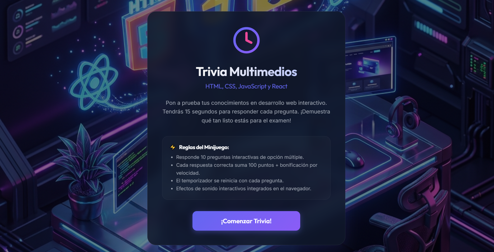
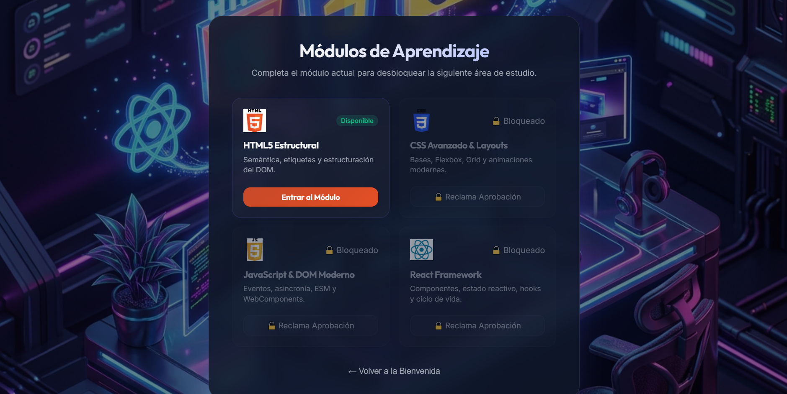
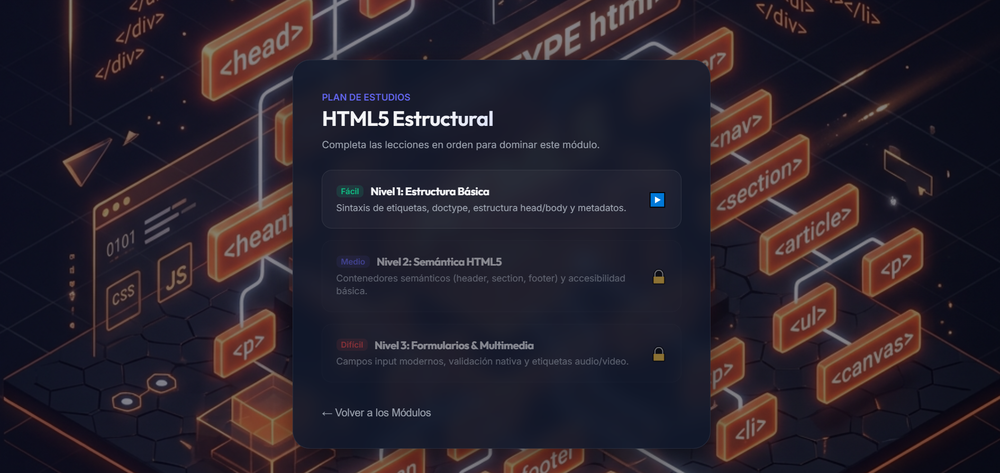
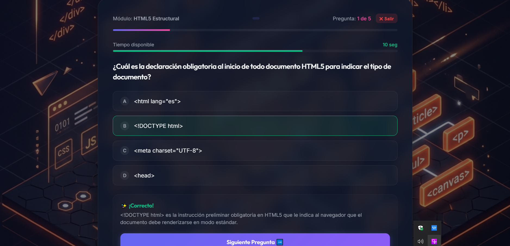
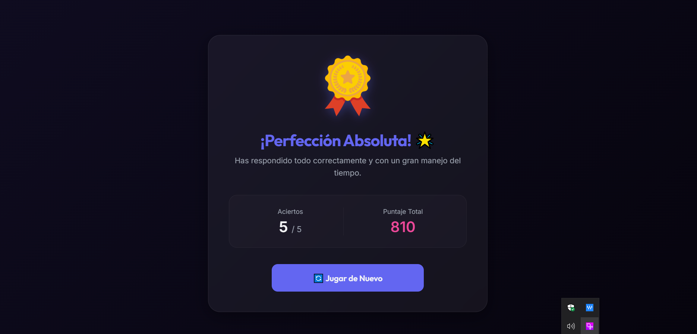

# Trivia Interactiva: Curso de Multimedios (UCR)

Este es un minijuego educativo en formato de trivia progresiva y evolutiva desarrollado para el curso **IF7102 - Multimedios** (I Ciclo 2026) en la **Universidad de Costa Rica (UCR)**. Su objetivo es evaluar y reforzar los conocimientos de desarrollo web en cuatro grandes áreas temáticas.

## Framework Elegido
* **React (v19+) con Vite**

---

## Estructura y Reglas del Juego

El juego ha sido diseñado con una arquitectura modular y progresiva para simular el plan de estudios del curso:

### 1. Módulos Principales
La trivia se organiza en 4 áreas temáticas ordenadas de forma secuencial:
1. **HTML5 Estructural:** Semántica, etiquetas y estructuración del DOM.
2. **CSS Avanzado & Layouts:** Flexbox, CSS Grid, selectores y animaciones.
3. **JavaScript & DOM Moderno:** Manipulación del DOM, eventos, asincronía y ESM.
4. **React Framework:** Componentes, hooks, estado reactivo y ciclo de vida.

*Regla de Desbloqueo:* Para poder acceder al siguiente módulo principal, el usuario debe aprobar los tres sub-niveles del tema actual en orden.

### 2. Sub-Niveles Académicos (3 por tema)
Cada módulo principal cuenta con su propio selector de lecciones:
* **Nivel 1: Conceptos Básicos** (Dificultad: Fácil)
* **Nivel 2: Intermedio / Semántica** (Dificultad: Medio)
* **Nivel 3: Avanzado / Integración** (Dificultad: Difícil)

### 3. Tipos de Preguntas Soportadas
La interfaz de juego se adapta dinámicamente según el nivel seleccionado:
* **Opción Múltiple (`choice`):** Preguntas de selección simple con botones de opción múltiple (Niveles 1 y 2).
* **Completar Código (`fill`):** Se muestra un bloque de código formateado con un espacio en blanco (`___`) y una caja de texto input para escribir la propiedad, etiqueta o método correcto (Nivel 3).

---

##  Instrucciones de Ejecución

1. **Instalar dependencias:**
   ```bash
   npm install
   ```

2. **Iniciar servidor local (Vite):**
   ```bash
   npm run dev
   ```

3. **Ejecutar pruebas de producción:**
   ```bash
   npm run build
   ```

---

## Arquitectura de Componentes de la Aplicación

* `/src/App.jsx`: Componente principal que maneja los estados globales (módulo activo, nivel activo, puntuación, y desbloqueos de lecciones y módulos).
* `/src/components/ModuleDashboard.jsx`: Dashboard principal de selección de temas (HTML, CSS, JS, React) con candados visuales de progreso.
* `/src/components/LevelSelector.jsx`: Selector de sub-niveles de estudio con la descripción académica y dificultad de cada lección.
* `/src/components/StartScreen.jsx`: Pantalla de bienvenida con las instrucciones y reglas generales de juego.
* `/src/components/GameScreen.jsx`: Pantalla activa del juego que renderiza condicionalmente el panel de selección múltiple o el editor de completado de código.
* `/src/components/ResultScreen.jsx`: Tarjeta con las estadísticas detalladas, aciertos, puntajes y retroalimentación personalizada.
* `/src/components/ProgressBar.jsx`: Barra de progreso animada mediante transiciones CSS.
* `/src/utils/audio.js`: Módulo de efectos de sonido.

---

## 📸 Capturas de Pantalla

A continuación, se presenta un recorrido visual de la experiencia inmersiva del juego interactivo:

**1. Pantalla de Bienvenida**

*Vista inicial de la aplicación, donde se presentan las reglas del juego y el objetivo de la trivia web.*

**2. Dashboard Principal de Módulos**

*Menú principal con la selección de las cuatro áreas temáticas: HTML5, CSS3, JS Moderno y React.*

**3. Selector de Sub-Niveles**

*Vista de los sub-niveles disponibles al ingresar a un módulo específico (ej. HTML5), mostrando el plan de estudios y la dificultad.*

**4. Interfaz de Juego (Pregunta Activa)**

*Pantalla de trivia interactiva con el temporizador corriendo, opciones múltiples y el diseño glassmorphism inmersivo.*

**5. Resultados y Retroalimentación**

*Pantalla de estadísticas al finalizar un sub-nivel, donde se muestra el puntaje final, un trofeo de recompensa (si se aprueba) y el fondo adaptado.*
